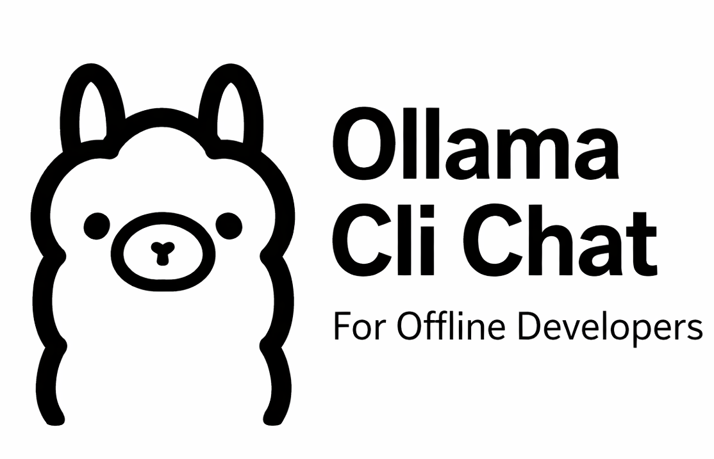

# Ollama Cli Chat
**For Offline Developers**

A lightweight **CLI-First alternative to WebUIs** for interacting with **Ollama**, designed to simplify local and offline LLM usage via **Docker** or **direct API access**.

Perfect if you want:
- No browser
- No cloud dependency
- Fast terminal-based interaction with your local LLMs

---

## Features

- 🧠 Chat with Ollama models directly from your terminal
- 📴 Built for **Offline-First Developers**
- 🐳 Works seamlessly with **Dockerized Ollama**(direct API call)
- 🔌 Uses Ollama’s native API (`0.0.0.0:11434`)
- 🌐 Supports local-network Ollama instances via `OLLAMA_BASE_URL`
- ⚡ Minimal binary, zero runtime dependencies

---

## Installation

### 1. Download the Binary

Download the correct binary for your system:

- **macOS (Apple Silicon):** `arm64`
- **Linux:** `amd64`
- **Windows:** (Clone the project and build it for your target architecture.)

Download the binary from the **Releases** section.

**[Download Binary (Linux amd64)](./ollama-chat-cli-amd64)**<br>
**[Download Binary (Max arm64)](./ollama-chat-cli-arm64)**


---

### 2. Move Binary to `~/bin`(create if it doesn’t exist)

```bash
mkdir -p ~/bin
mv ollama-cli-chat ~/bin/ol
chmod +x ~/bin/ol
```

You may rename `ol` to anything you prefer.

Ensure `~/bin` is in your `$PATH`:

```bash
export PATH="$HOME/bin:$PATH"
```

---

## Configure Ollama Base URL (Local Network)

To use a running Ollama instance exposed within your local network, set the `OLLAMA_BASE_URL` environment variable.

Add the following line to your shell config:

- `~/.bashrc`
- `~/.zshrc`
- or any other shell profile you use

```bash
export OLLAMA_BASE_URL=http://<OLLAMA_IP>:11434
```

Apply the changes:

```bash
source ~/.bashrc
# or
source ~/.zshrc
```

This allows the CLI to communicate with Ollama running on another machine or container in the same network.

---

## Running Ollama with Docker

If Ollama is not already running, use Docker.

### docker-compose.yml

```yaml
services:
  ollama:
    image: ollama/ollama
    container_name: ollama
    ports:
      - "11434:11434"
    volumes:
      - ./ollama-v:/root/.ollama
    restart: unless-stopped


volumes:
  ollama:
```

Start Ollama:

```bash
docker compose up -d
```

---

## Usage

Start the CLI:

```bash
ol
```

---

### Help

```bash
ol help
```

#### Multiline Input

- Start with `..` and press **Enter**
- End with `..` and press **Enter**

---

### Available Commands

| Command | Description                           |
|---------|---------------------------------------|
| `\h`   | Show Help                             |
| `\q`   | Quit the session                      |
| `\i`   | Show chat information                 |
| `\c`   | Show the currently selected model     |
| `\m`   | Select a different model              |
| `\p`   | Pull/download an available LLM model  |
| `\d`   | Delete an existing model              |
| `\n`   | Start a new session (clears last Q/A) |


---

## License

MIT
